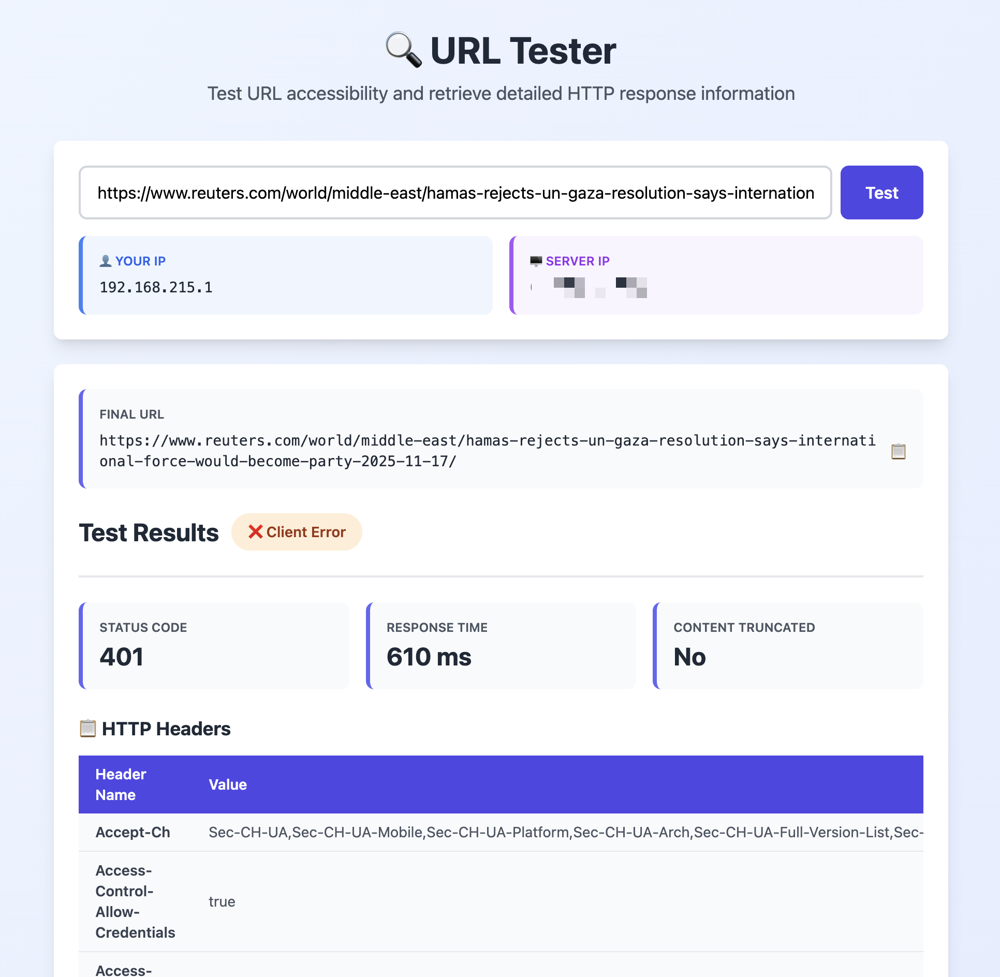

# URL Checker

A simple HTTP URL testing service built with Go. Quickly debug why URLs fail - check if you're blocked, rate-limited, or hitting other issues.

## Why You Need This

With so many AI crawlers out there, websites often block requests. This tool helps you:

- Detect if your IP is blocked (403/429 responses)
- Check if redirects are causing issues
- See exact HTTP status and headers
- Measure response times
- Verify SSL/TLS errors
- Debug why your requests fail

## Features

- Check HTTP status code and response time
- View response headers and body preview
- Track redirects
- Detect blocked requests (403/429)
- See SSL/TLS errors
- Web UI included

## Screenshot



## Quick Start

### Prerequisites

- Go 1.21+

### Run Locally

```bash
go mod download
go run main.go
```

Visit `http://localhost:8080`

### Test API

```bash
curl -X POST http://localhost:8080/api/test \
  -H "Content-Type: application/json" \
  -d '{"url": "https://example.com"}'
```

## Make Commands

```bash
make build              # Compile
make run                # Run locally
make test               # Run tests
make test-coverage      # Show coverage
make docker-build       # Build Docker image
make docker-run         # Run Docker locally
```

## Docker

### From Docker Hub

```bash
# Pull the latest image
docker pull sammylin/url_checker:latest

# Run the container
docker run -p 8080:8080 sammylin/url_checker:latest
```

### Build Locally

```bash
docker build -t url-checker .
docker run -p 8080:8080 url-checker
```

### Custom Port

```bash
docker run -p 9000:8080 -e PORT=8080 sammylin/url_checker:latest
```


## API

### POST /api/test

Request:
```json
{
  "url": "https://example.com"
}
```

Response (Success):
```json
{
  "success": true,
  "statusCode": 200,
  "responseTime": 234,
  "finalUrl": "https://example.com/",
  "headers": {
    "Content-Type": "text/html",
    "Server": "nginx"
  },
  "bodyPreview": "<!DOCTYPE html>...",
  "truncated": false,
  "blocked": false,
  "userIP": "1.2.3.4",
  "serverIP": "5.6.7.8"
}
```

Response (Error):
```json
{
  "success": false,
  "error": "DNS error: host not found",
  "blocked": false,
  "userIP": "1.2.3.4",
  "serverIP": "5.6.7.8"
}
```

### GET /health

Returns `OK`

## Environment

- `PORT` - Server port (default: 8080)

## Debugging Guide

### Check if You're Blocked

```bash
curl -X POST http://localhost:8080/api/test \
  -H "Content-Type: application/json" \
  -d '{"url": "https://example.com"}'
```

Look for:
- `"statusCode": 403` - Access forbidden
- `"statusCode": 429` - Rate limited
- `"blocked": true` - Detected as blocked

### Check Redirects

If a URL redirects, you'll see:
```json
{
  "finalUrl": "https://example.com/redirected",
  "statusCode": 200
}
```

Some sites redirect blocked requests to a login page. Check the `finalUrl` to see where you ended up.

### Check SSL/TLS Issues

If there's an SSL error:
```json
{
  "error": "x509: certificate signed by unknown authority"
}
```

This means the certificate chain is broken or self-signed.

### Check Response Headers

Headers tell you a lot:
- `Server: cloudflare` - Behind Cloudflare (may have stricter rules)
- `X-Frame-Options: DENY` - Can't iframe this
- `Retry-After: 3600` - Rate limited, retry in 1 hour

### Common Issues

**403 Forbidden**
- Your IP is blocked
- User-Agent is blocked
- Missing required headers

**429 Too Many Requests**
- Rate limited
- Too many requests from your IP
- Need to add delays between requests

**Connection Timeout**
- Server is down
- Firewall blocking
- Network issue

**SSL Certificate Error**
- Self-signed certificate
- Expired certificate
- Wrong domain

## Development

```bash
# Run tests
go test ./...

# Format code
gofmt -w main.go

# Check coverage
go test -cover ./...
```

## License

MIT
